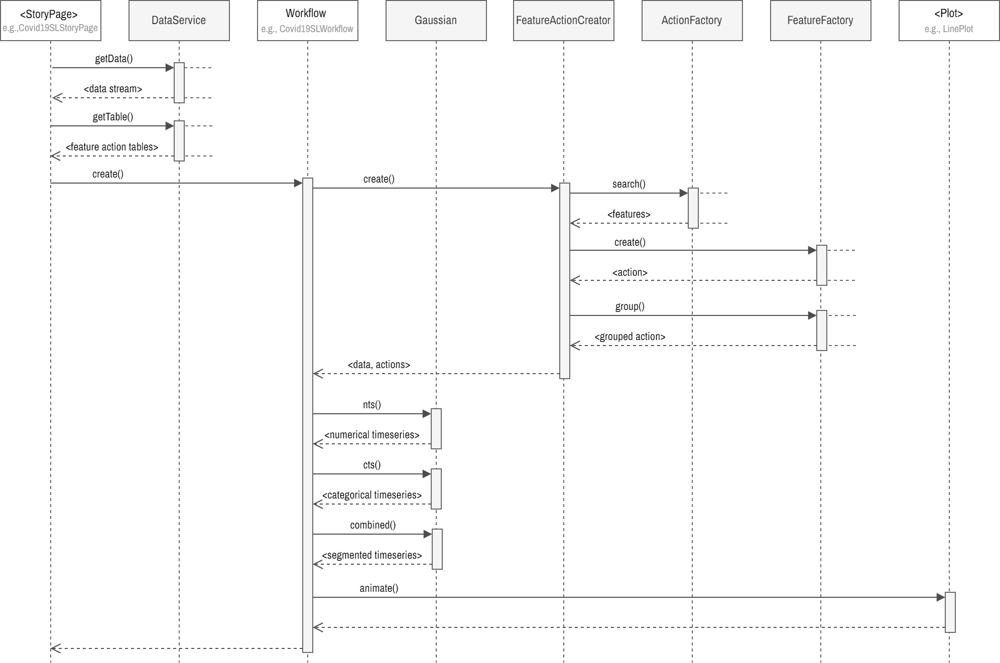
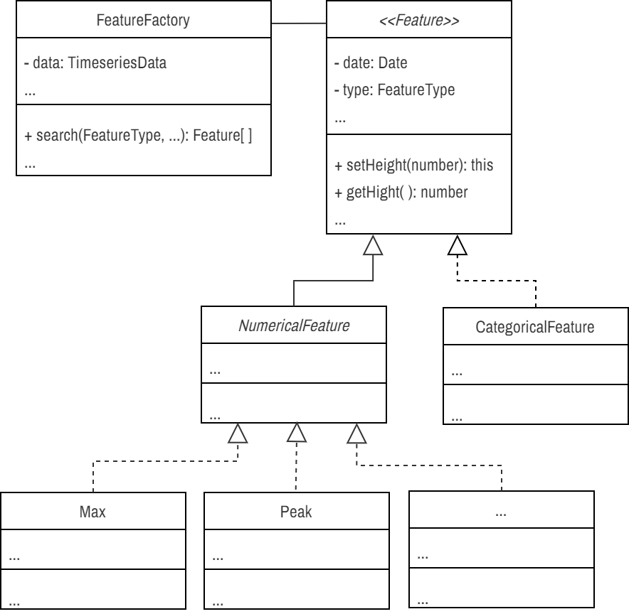
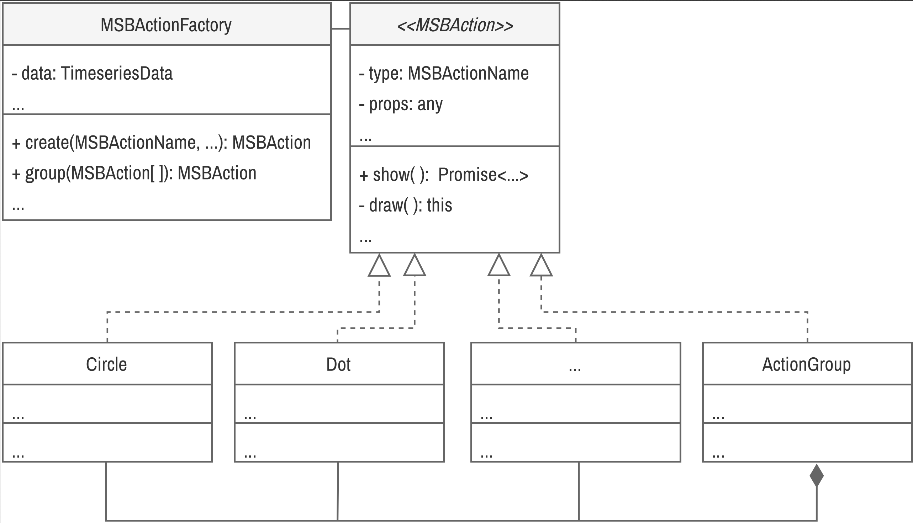
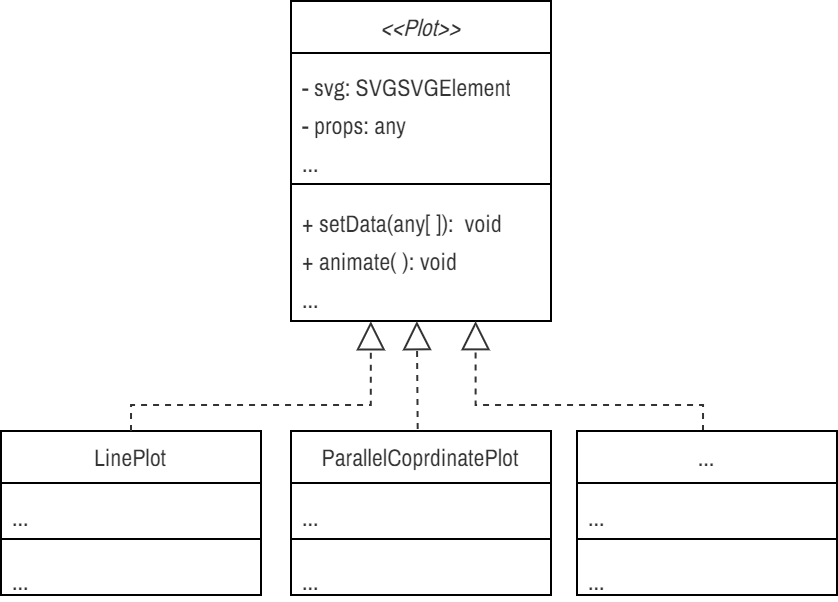
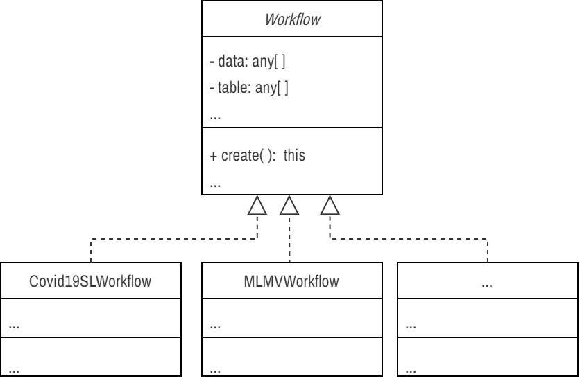

# About

This repository contains the source code accompanying our research on utilizing feature-action design patterns for creating storytelling visualizations with time series data. Our work is detailed in the paper titled [Feature-Action Design Patterns for Storytelling Visualizations with Time Series Data](https://arxiv.org/abs/2402.03116v1)

## Prerequisite

- Node.js v20.11.1
- yarn or npm

## Getting Started

Clone the repository and install dependencies:

```bash
git clone https://github.com/saifulkhan/storytelling-vis.git
cd storytelling-vis
yarn install
```

Start the development server to view the UI:

```bash
yarn dev
```

Open [http://localhost:3000](http://localhost:3000) in your browser to explore the visualizations.

### Tests

Execute unit tests:

```sh
yarn test
```

Note: unit tests are under development and may not cover all features.

# Documentation

## Code Structure

The project is structured following React and Next.js guidelines and practices:

- `src/components`: UI components including feature action tables, actions, and plots.
- `src/pages`: Web pages including storyboards, feature-action tables, and examples.
- `src/services`: Time series and feature action table data services.
- `src/utils`: Utility functions for data processing, feature and action extraction, and workflow.

## Sequence Diagram

<!-- <div align="center">  -->
<div>
    
    <br>
    <small><i>Figure 1: Sequence diagram demonstrating the important classes' and main interaction between various functions.</i></small>
    <br><br>
</div>

## APIs

### Feature

<div>
    
    <br>
    <small><i>Figure 2: The ULM diagram of the features. We did not show all the classes or their methods and attributes in this diagram. </i></small>
    <br><br>
</div>

The `Feature` is an abstract class encapsulates both numerical and semantic attributes of time series data through its subclasses, `NumericalFeature` and `CategoricalFeature`. These base classes serving the foundation for concrete classes such as specific implementations like `Peak`, `Min`, `Max`, etc., it provides a structured approach to define timeseries data features. Developers can extend this base class to introduce any number of specialized features.

**Feature Types:** Various features are defined as enumerators, e.g.,

```ts
export enum FeatureType {
  CURRENT = "CURRENT",
  LAST = "LAST",
  MAX = "MAX",
  MIN = "MIN",
  PEAK = "PEAK",
  VALLEY = "VALLEY",
  FALL = "FALL",
  RAISE = "RAISE",
  SLOPE = "SLOPE",
}
```

 To instantiate a feature, use the constructor of a concrete feature class. Set properties using method chaining:

For example, when a feature `PEAK` is detected it creates a `Peak` object as follows. The default feature properties are used unless defined in feature-action table.

```ts
new Peak()
    .setDate(...)
    .setHeight(...)
    .setNormWidth(...)
    .setNormHeight(...)
    .setRank(...)
    .setMetric(...)
    .setStart(...)
    .setEnd(...)
    .setDataIndex(...);
```

**Feature Factory:** The `FeatureFactory` class implements a factory design pattern for streamlined feature creation, utilizing search functions to dynamically generate feature instances based on input feature action table and time series data.

**Code:** Explore the `src/utils/storyboards/feature` directory for details on the available features and their implementations.

**Example:** See an example feature detection and its visualization [page](http://localhost:3000/storyboards/examples/test-features).

### Feature Search & Gaussian

The feature search or detection functions are implemented in `feature-search.ts`. These functions are implemented as pure functions. The `gaussian.ts` file contains functions for calculating the Gaussian distributions of both numerical and categorical time series, as well as for generating a combined Gaussian useful for segmentation. These functions are designed as pure functions.

**Searching a Feature:**

```ts
TODO
```

**Code:** See the implementation of feature detection methods in `src/utils/storyboards/feature` in Gaussian functions in `src/utils/storyboards/data-processing`.

**Example:** See examples visualization of [numerical timeseries](http://localhost:3000/storyboards/examples/test-gaussian-nts), [categorical timeseries](http://localhost:3000/storyboards/examples/test-gaussian-cts) and [combined gaussian](http://localhost:3000/storyboards/examples/test-gaussian-combined).

### Actions

<div>
    
    <br>
    <small><i>Figure 3: Action classes.</i></small>
    <br><br>
</div>

The `Action` abstract class serves as a blueprint for defining atomic actions, e.g., circles, dots, etc. represented by `Circle` and `Dot` classes respectively.

**Action Type:** Various actions are defined as enumerators, e.g.,

```ts
export enum ActionType {
  DOT = "DOT",
  CIRCLE = "CIRCLE",
  TEXT_BOX = "TEXT_BOX",
  CONNECTOR = "CONNECTOR",
}
```

**Creating Actions:** Instantiate a `Circle` action object and display it within a svg canvas. The default action properties are used unless defined in feature-action table.

```ts
new Circle()
    .setProps(CircleProps)
    .setCanvas(SVGGElement)
    .setCoordinate([Coordinate, Coordinate])
    .show();
```

Animated movement for objects, e.g., `TextBox`, can be achieved by:

```ts
new TextBox()
    .setProps(...)
    .setCanvas(...)
    .setCoordinate(...)
    .show()
    .move(Coordinate, delay, duration);
```

**Group Actions:**  The `ActionGroup` class employs a composite design pattern to group multiple actions representing a feature, as shown in an example below:

```ts
new ActionGroup()
    .group([<array of actions>])
    .setCanvas(...)
    .setCoordinate(...)
    .show();
```

**Action Factory:** The `ActionFactory` utilizes a factory design pattern to simplify the creation of action objects, making it more efficient to generate actions from feature action tables.

**Code:** Further details can be found in the `src/components/storyboards/actions` directory.

**Example:** Example creation and visualization of various actions [🔗](http://localhost:3000/storyboards/examples/test-actions).

### Plots

<div>
    
    <br>
    <small><i>Figure 4: Plot classes.</i></small>
    <br><br>
</div>

`Plot` is an abstract class which defines abstract methods used for creating a plot, setting properties, and animating. The concrete plots, e.g, line plot, parallel coordinate plots implements the actual logics.

**Creating a Plot:** Create a line plot and animate actions,

```ts
new LinePlot()
    .setData(TimeseriesData[]])
    .setName(name or key)
    .setProps([])
    .setPlotProps(PlotProps)
    .setCanvas(SVGGElement)
    .setActions(<action data>)
    .animate()
```

**Code:** See the implementation of various plots in `src/components/storyboards/plots`.

**Example:** See an example [line plot](http://localhost:3000/storyboards/examples/test-line-plot).

### Feature Action Tables

**Numerical**

**Categorical**

TODO
Feature action tables are implemented as nested React components.

**Code:** See the implementation of various action classes in `/src/components/storyboards/tables` and `src/pages/storyboards` for more details.

**Example:** components of feature action tables

- Feature properties table [🔗](http://localhost:3000/storyboards/examples/test-feature-properties-table)
- Action properties table [🔗](http://localhost:3000/storyboards/examples/test-action-properties-table)
- Action table [🔗](http://localhost:3000/storyboards/examples/test-action-table)

📈 Example feature action tables

- Covid19 single story numerical feature action table [🔗]()
- Covid19 categorical feature table [🔗]()
- Machine learning multi-variate story numerical feature action table [🔗]()

### Workflow

<div>
    
    <br>
    <small><i>Figure 3: Workflow classes.</i></small>
    <br><br>
</div>

Workflows are story specific. Fore each story a concrete workflow class is defined extended from abstract`Workflow` class.

**Creating a Workflow:** For example, Covid19 single location workflow is created by,

```ts
new Covid19SLWorkflow()
    .setName(region)
    .setData(regionData)
    .setNFATable(tableNFA)
    .setCanvas(chartRef.current)
    .create();
```

**Code:** See the implementation of workflows in `src/utils/storyboards/workflow` for more details `src/pages/storyboards`.

**Example:** [Covid19 story with single timeseries](http://localhost:3000/storyboards/covid19-sl-story), and [Machine learning multi-variate story](http://localhost:3000/storyboards/ml-mv-story).

## References

Please cite our paper as follows:

```
@article{khan2024,
    title={Feature-Action Design Patterns for Storytelling Visualizations with Time Series Data}, 
    author={S. Khan and S. Jones and B. Bach and J. Cha and M. Chen and J. Meikle and J. C. Roberts and J. Thiyagalingam and J. Wood and P. D. Ritsos},
    journal={arXiv preprint arXiv:2402.03116},
    year={2024},
}
```

- The first version of the prototype was done in  Observable notebook and can be found in [observablehq](https://observablehq.com/d/0a6e9c35a809660e).
- Second version of prototype ported from Observable notebook to React.js can be found in [GitHub](https://github.com/saifulkhan/storytelling-vis-v.0.1). These prototypes contain six stories, however only two stories are ported to this new software.
- Used [React.js](https://react.dev), [Next.js](https://github.com/vercel/next.js), [MUI](https://mui.com) libraries for the UI development.
