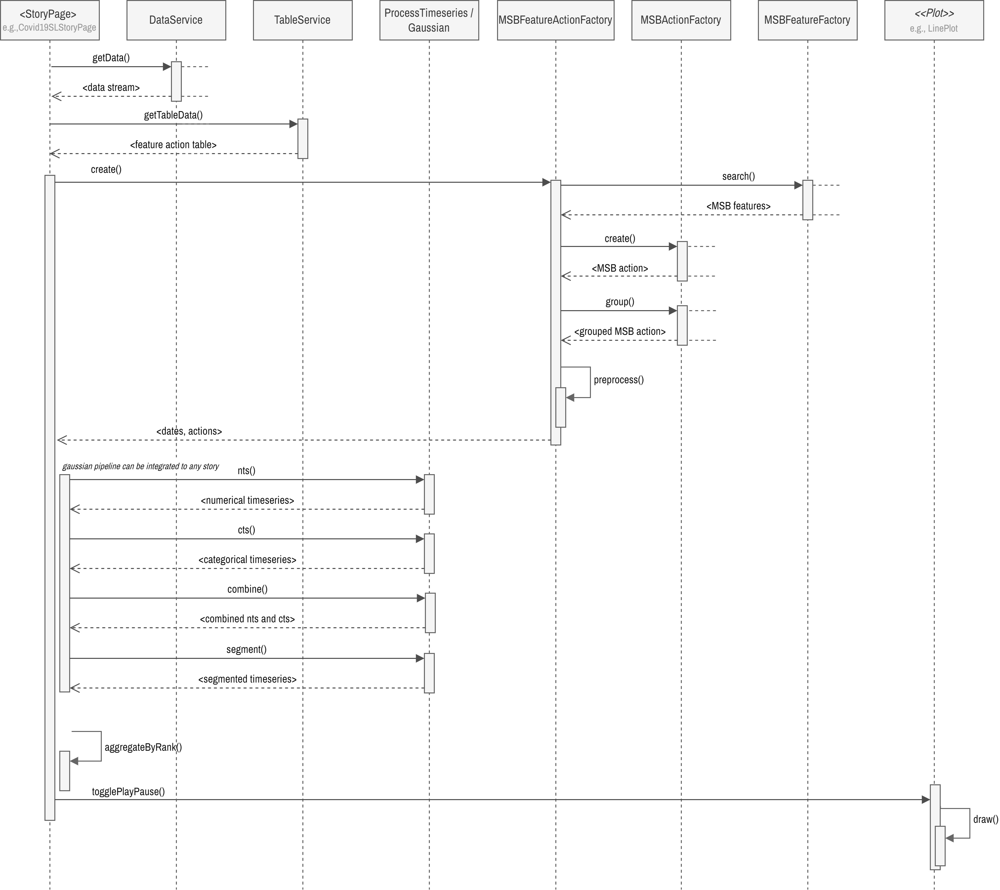

Meta-Storyboarding Using Feature-Action Design Pattern


# API User Guide


```bash
npm install storytelling-vis
# or
yarn add storytelling-vis

```


```jsx
import React from 'react';
import { LinePlot, Circle } from 'storytelling-vis';
 const MyComponent = () => {
  const svgRef = React.useRef(null);
   React.useEffect(() => {
    if (svgRef.current) {
      // Create a line plot with your data
      const plot = new LinePlot()
        .setData(myData)
        .setCanvas(svgRef.current)
        .show();
    }
  }, []);

```

```jsx
import React from 'react';
import { LinePlot, Circle, MSBActionFactory } from 'storytelling-vis';

const MyComponent = () => {
  const svgRef = React.useRef(null);
  
  React.useEffect(() => {
    if (svgRef.current) {
      const data = [...]; // Your time series data
      
      // Create a line plot
      const plot = new LinePlot()
        .setData(data)
        .setName('My Data')
        .setProps({
          width: 800,
          height: 400,
          margin: { top: 20, right: 20, bottom: 30, left: 50 }
        })
        .setCanvas(svgRef.current);
      
      // Show the plot
      plot.show();
      
      // Create actions
      const actionFactory = new MSBActionFactory();
      const circle = actionFactory.create('CIRCLE', {
        size: 10,
        color: 'red'
      });
      
      // Add actions to the plot
      circle.setCanvas(svgRef.current)
        .setCoordinate([100, 100])
        .show();
    }
  }, []);
  
  return <svg ref={svgRef} width="800" height="400"></svg>;
};

export default MyComponent;
```

---


# API Design & Development

For more details of available APIs see the documents below.


## Getting Started

The following environment and packages are required.

- Node.js v20.11.1
- yarn or npm

Clone the repository.

```bash
git clone https://github.com/saifulkhan/storytelling-vis.git
cd storytelling-vis

```

Install all dependent packages and start the development server to view the UI.

```bash
yarn install
yarn dev
```

Open <http://localhost:3000> in your browser. Go to the section [UI](#ui) to see a few examples. These are the following list of UIs:

**Example Stories:**

- <http://localhost:3000/story-covid19-single>
- <http://localhost:3000/story-ml-mirorred-bar>
- <http://localhost:3000/story-ml-pcp>


**Playground (testing various components):**

- <http://localhost:3000/playground/test-action-properties-table>
- <http://localhost:3000/playground/test-action-table>
- <http://localhost:3000/playground/test-actions>
- <http://localhost:3000/playground/test-feature-properties-table>
- <http://localhost:3000/playground/test-features>
- <http://localhost:3000/playground/test-gaussian-combined>
- <http://localhost:3000/playground/test-gaussian-cts>
- <http://localhost:3000/playground/test-gaussian-nts>
- <http://localhost:3000/playground/test-line-plot>
- <http://localhost:3000/playground/test-play-pause-loop>


### Tests

Execute unit tests:

```sh
yarn test
```

Note: unit tests are under development and may not cover all features.


## Code Structure

The project is structured following React and Next.js guidelines and practices.

```
.
└── src
    ├── components          /* UI or VIS components */
    │   ├── actions         /* Various MSB actions */
    │   ├── plots           /* Various plots */
    │   └── tables          /* Feature-action table related (experimental) */
    ├── hooks               /* Custom hooks for animation control */
    ├── pages
    │   └── playground      /* React pages for testing components */
    ├── types             
    └── utils                     
        ├── data-processing /* Data processing, gaussian */
        └── feature-action  /* MSB feature-action utilities */
```

## Meta-Storyboard (MSB) API

### Feature Action Table Data Structures

We implemented a user interface for meta-story authors for creating and updating feature action tables. The data structures of the tables are shown below. The feature action tables are implemented as nested React.js components.

**Numerical Feature Action**

```json
{
    "featureName": "...",
    "featureProperties": {"..."},
    "rank": "...",
    "actions": [
      {
        "actionName": "...",
        "actionProperties": {
          "size": "...",
          "color": "...",
          "...": "...",
        }
      },
      "..."
    ],
},
```

**Categorical Feature Action**

```json

  {
    "featureName": "...",
    "date": "...",
    "description": "...",
    "rank": "...",
    "actions": [
      {
        "actionName": "...",
        "actionProperties": {
          "size": "...",
          "color": "...",
          "...": "...",
        }
      },
      "..."
    ]
  },
```

 TODO: Refactor the key / variable name in the code!

**MSB Feature Action Factory:** The `MSBFeatureActionFactory` translates the meta-stories defined as feature action tables to MSB feature objects and MSB action objects. It internally uses the `MSBFeatureFactory` and `MSBActionFactory` classes, which will be discussed later, to do so. Instantiate this class as follows:

```js
new MSBFeatureActionFactory(...)
    .setProperties(...)
    .setNFATable(...)
    .setNFATable(...)
    .setData(...)
    .create();
```

**Code:**  See the implementation of all tables as nested components in `src/components/storyboards/tables` folder and feature action table reader, feature to action mapping classes in `src/utils/storyboards/feature-action` folder. The web templates or pages of feature action tables are in `public/static/storyboards`.

**Example:** See the examples/tests in the UI.

### MSB Feature API

<div>
    
    <br>
    <small><i>Figure 2: The class diagram of the MSB feature classes. Please see the source code for all classes, their methods and attributes. </i></small>
    <br><br>
</div>

The `MSBFeature` is an abstract class that encapsulates both numerical and semantic attributes of time series data through its subclasses, `NumericalFeature` and `CategoricalFeature`. These base classes serve as the foundation for concrete classes such as specific implementations like `Peak`, `Min`, `Max`, etc., it provides a structured approach to define features of time series data. Developers can extend this base class to implement new features.

**Feature Names:** Features are defined as enumerators, e.g.,

```ts
export enum MSBFeatureName {
  FIRST = "FIRST",
  CURRENT = "CURRENT",
  LAST = "LAST",
  MAX = "MAX",
  MIN = "MIN",
  PEAK = "PEAK",
  VALLEY = "VALLEY",
  FALL = "FALL",
  RAISE = "RAISE",
  SLOPE = "SLOPE",
  ...
}
```

**Creating MSB Feature:** To instantiate a feature, use the constructor of a concrete feature class. Set properties using method chaining. For example, when a feature `PEAK` is detected it creates a `Peak` object as follows. The default feature properties are used unless defined in feature-action table. Use the getter functions to retrieve the feature properties.

```ts
new Peak()
    .setDate(...)
    .setHeight(...)
    .setNormWidth(...)
    .setNormHeight(...)
    .setRank(...)
    .setMetric(...)
    .setStart(...)
    .setEnd(...)
    .setDataIndex(...);
```

**MSB Feature Factory:** The `MSBFeatureFactory` class implements a factory design pattern for streamlined feature creation, utilizing search functions to dynamically generate feature instances based on input feature action table and time series data.

```js
new MSBFeatureFactory()
    .setProperties()
    .setData()
    .search(<feature name>, <properties>, ...);
```

**Code:** Explore the `src/utils/storyboards/feature` directory for details on the available features and their implementations.

**Example:** See the examples/tests in the UI.

### MSB Action API

<div>
    
    <br>
    <small><i>Figure 3: Action classes. Please see the source code for all classes, their methods and attributes. </i></small>
    <br><br>
</div>

The `MSBAction` abstract class serves as a blueprint for defining atomic actions, e.g., circles, dots, etc. represented by `Circle` and `Dot` classes respectively.

**MSB Action Names:** Various actions are defined as enumerators, e.g.,

```ts
export enum MSBActionName {
  DOT = "DOT",
  CIRCLE = "CIRCLE",
  TEXT_BOX = "TEXT_BOX",
  CONNECTOR = "CONNECTOR",
  ...
}
```

**Creating MSB Actions:** Instantiate a `Circle` action object and display it within an SVG canvas. The default action properties are used unless defined in the feature-action table.

```ts
new Circle()
    .setProps(<props>)
    .setCanvas(<svg>)
    .setCoordinate(<coordinates>)
    .show();
```

Animated movement for objects, e.g., `TextBox`, can be achieved by:

```ts
new TextBox()
    .setProps(...)
    .setCanvas(...)
    .setCoordinate(...)
    .show()
    .move(<coordinates>, ...);
```

**Group MSB Actions:**  The `ActionGroup` class employs a composite design pattern to group multiple actions representing a feature, as shown in an example below:

```ts
new MSBActionGroup()
    .group(<actions>)
    .setCanvas(...)
    .setCoordinate(...)
    .show();
```

**MSB Action Factory:** The `ActionFactory` utilizes a factory design pattern to simplify the creation of action objects, making it more efficient to generate actions from feature action tables.

```js
new MSBActionFactory()
    .create(<action name>, <action properties>)
```

**Code:** See the available actions in the `src/components/storyboards/actions` folder.

**Example:** See the examples/tests in the UI.

### Feature Search & Gaussian API

The feature search or detection functions are implemented in `feature-search.ts`. These functions are implemented as pure functions. The `gaussian.ts` file contains functions for calculating the Gaussian distributions of both numerical and categorical time series, as well as for generating a combined Gaussian useful for segmentation. These functions are designed as pure functions.

**Feature Detection:** The following are examples API for peak detection.

```ts
searchPeaks(<time series>, <properties, e.g., window>)
```

**Gaussian:** The following are API for computing Gaussian distributions.

```ts
gaussian(<mean>, <std>, ...)
```

**Code:** See the available feature search or detection functions in `src/utils/storyboards/feature/feature-search.ts` and all Gaussian functions in `src/utils/storyboards/data-processing/Gaussian.ts`.

**Example:** See the examples/tests in the UI.

### Animated Plots API

<div>
    
    <br>
    <small><i>Figure 4: Plot classes.</i></small>
    <br><br>
</div>

`Plot` is an abstract class that defines abstract methods used for creating a plot, setting properties, and animating. The concrete plots, e.g., line plot, and parallel coordinate plots implement the actual logic.

**Creating a Plot:** Create a line plot and animate actions,

```ts
new LinePlot()
    .setData(<time series data>)
    .setName(<selected data stream name>)
    .setProps(<props>)
    .setPlotProps(<plot props>)
    .setCanvas(<svg>)
    .setActions(<actions>)
    .animate()
```

**Code:** See various plots and their API in `src/components/storyboards/plots` folder.

**Example:** See the examples/tests in the UI.

### Creating Story

<!-- <div align="center">  -->
<div>
    
    <br>
    <small><i>Figure 1: Sequence diagram demonstrating a story creation process and important classes and methods involved.</i></small>
    <br><br>
</div>

**Code:** See the implementation of story pages in `src/pages/storyboards` folder.

**Example:** See COVID-19 story with a single time series and Machine learning multi-variate story in the UI.

## UI

### Feature Action Tables UI

This is incomplete functionality. To add a new table, see `src/services/TableService.ts`


## Building the Library

```bash
yarn install
yarn build:lib
```

This will generate the library in the `dist` directory. Using the Library in Another Project

**Option 1: Local Installation**

You can install the library locally using:

```bash
npm install --save /path/to/storytelling-vis
# or
yarn add file:/path/to/storytelling-vis
```

**Option 2: Publishing to npm**

Publish the library to npm:

```bash
npm login
npm publish
```
Then install it in your project (as discussed  at the beginning of this document)
 

---


# Support

If you want to use this code and need help please reach out to me via GitHub issues  [⤴](<https://github.com/saifulkhan/storytelling-vis/issues>). Also, please refer to the previous code and notebooks for additional plots and early prototypes.  


The first version of the prototype was done in  Observable notebook in [⤴](https://observablehq.com/d/0a6e9c35a809660e). The second version of the prototype ported from Observable Notebook to React.js in GitHub[⤴](https://github.com/saifulkhan/storytelling-vis-v.0.1). The previous prototypes contain six stories, however, we only ported three stories to this repository.

## References

This project used d3.js[⤴](https://d3js.org/), React.js[⤴](https://react.dev), Next.js[⤴](https://github.com/vercel/next.js), Material UI[⤴](https://mui.com), and other libraries.

Our work is detailed in the paper titled "Feature-Action Design Patterns for Storytelling Visualizations with Time Series Data"[⤴](https://arxiv.org/abs/2402.03116v1). Please cite our paper as follows:

```
@article{khan2024,
    title={Feature-Action Design Patterns for Storytelling Visualizations with Time Series Data}, 
    author={S. Khan and S. Jones and B. Bach and J. Cha and M. Chen and J. Meikle and J. C. Roberts and J. Thiyagalingam and J. Wood and P. D. Ritsos},
    journal={arXiv preprint arXiv:2402.03116},
    year={2024},
}
```