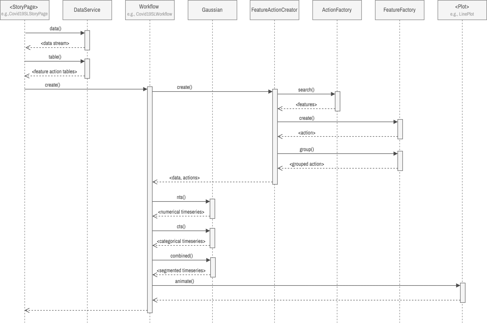
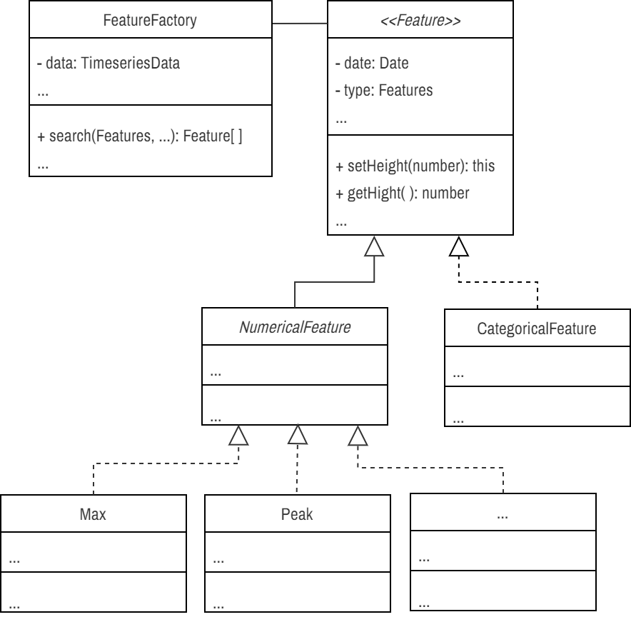
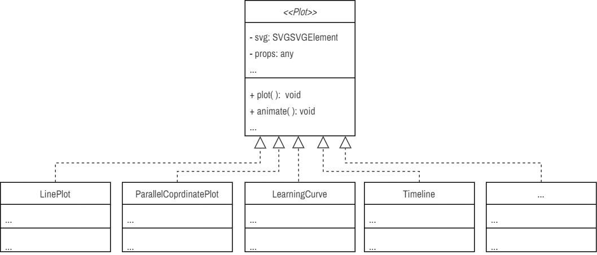
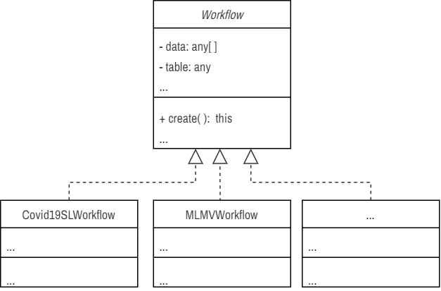

# About

This is the source code of our paper titled Feature-Action Design Patterns for Storytelling Visualizations with Time Series Data.

## Prerequisite

- Node.js v20.11.1
- yarn or npm

## Getting Started

Install the packages and dependencies,

```bash
yarn install
```

To start the UI, run the development server,
```bash
yarn dev
```

Open [http://localhost:3000](http://localhost:3000) with your browser to see the UI.

### Tests

```sh
yarn test
```

> Note: Unit tests have yet to be extensively implemented.

## Code Structure

We followed the commonly used React and Next.js project structure to organise the source code, with the important folders and files listed below.

```
TODO
```

## API Documentation

### Sequence Diagram

<div align="center">
    
    <br>
    <p>Figure 1: Sequence diagram demonstrating the classes' most important interaction or function calls. </p>
</div>

### Feature

<div align="center">
    
    <p>Figure 2: The ULM diagram of the features. We did not show all the classes or their methods and attributes. Please browse the source code for more information. </p>
</div>

`Feature` is an abstract class ...

Create a feature object:

```ts
new <FeatureName>()
    .setDate(Date)
    .setHeight(number)
    .setNormWidth(number)
    .setNormHeight(number)
    .setRank(number)
    .setMetric(string)
    .setStart(Date)
    .setEnd(Date)
    .setDataIndex(number);
```

For example, to create a PEAK or Peak object,

```ts
new Peak()
    .setDate(...)
    .setHeight(...)
    .setNormWidth(...)
    .setNormHeight(...)
    .setRank(...)
    .setMetric(...)
    .setStart(...)
    .setEnd(...)
    .setDataIndex(...);
```

`src/utils/storyboards/feature`

Examples visualization of feature detection:

- <http://localhost:3000/storyboards/examples/test-features>

### Feature Search

Pure functions `feature-search.ts` ... `FeatureSearch.ts` is  a wrapper class...

### Gaussian

Examples visualization of numerical and categorical time series and gaussian mixture:

- <http://localhost:3000/storyboards/examples/test-gaussian-nts>
- <http://localhost:3000/storyboards/examples/test-gaussian-cts>
- <http://localhost:3000/storyboards/examples/test-gaussian-combined>

## Drawing Actions

<div align="center">
    
</div>

`Action` is an abstract class which defines the blue print of an action. All the atomic actions, e.g., circle is implemented in `Circle` class, node is implemented in `Dot` class inherits this abstract class. A group of actions is defined in `ActionGroup` class .. composite design pattern. While we can create action objects just by creating instances ob the classes, we have `ActionFactory` which implements a factory design pattern to streamline and abstract away action creation directly from feature action table.

Create a action object:

```ts
new <ActionName>()
    .setProps(<Props>)
    .setCanvas(SVGGElement)
    .setCoordinate([Coordinate, Coordinate])
    .show();
```

Animate action show and hide:

```ts
await <action>.show(delay, duration);
await <action>.hide(delay, duration);
```

For example, create a Circle or CIRCLE action object,

```ts
new Circle()
    .setProps(CircleProps)
    .setCanvas(SVGGElement)
    .setCoordinate([Coordinate, Coordinate])
    .show();
```

We implemented movement for `TextBox` to a specified coordinate:

```ts
const textBox 
= new TextBox()
    .setProps(...)
    .setCanvas(...)
    .setCoordinate(...)
    .show();

await textBox.move(Coordinate, delay, duration);
```

We implemented and tested various actions in `src/pages/storyboards/examples/test-actions.tsx` page and can be seen in action <http://localhost:3000/storyboards/examples/test-actions>

Group multiple actions to a single object.

```ts
new ActionGroup()
    .group([<array of actions>])
    .setCanvas(...)
    .setCoordinate(...)
    .show();
```

Please see the contents of `src/components/storyboards/actions` for details or implementing various different actions.

## Plots

<div align="center">
    
</div>


`Plot` is an abstract class

```ts
new <PlotName>()
    .setData([<array of data>])
    .setName(string)
    .setPlotProps(PlotProps)
    .set<plot specific>Props([])
    .setCanvas(SVGGElement)
    .setActions([<date and action>])
    .animate()

```

For example, line plot API

```ts
new LinePlot()
    .setData(TimeseriesData[]])
    .setName(name or key)
    .setPlotProps(PlotProps)
    .setLineProps([])
    .setCanvas(SVGGElement)
    .setActions(<action data>)
    .animate()

```

In order to draw static plot, use the `plot()` method, e.g.,

```ts
plot.plot()
```

See implementation of each plot class for more details.

See the example line plot `src/pages/storyboards/examples/test-line-plot.tsx` in action <http://localhost:3000/storyboards/examples/test-line-plot>.

## Feature Action Table

### Numerical Feature Action

Nested tables, each tables components are implemented separate React component.

- <http://localhost:3000/storyboards/examples/test-action-properties-table>
- <http://localhost:3000/storyboards/examples/test-feature-properties-table>
- <http://localhost:3000/storyboards/examples/test-action-table>

### Categorical Feature Action

## Workflow

<div align="center">
    
</div>


Story specific workflow

Page -> builder ->

Create workflow of a story:

```ts
new  <WorkflowName>()
    .setName(...)
    .setData(...)
    .setNFATable(...)
    .setCanvas(...)
    .create();
```

For example, Covid19 single location workflow is setup as,

```ts
new Covid19SLWorkflow()
    .setName(region)
    .setData(regionData)
    .setNFATable(tableNFA)
    .setCanvas(chartRef.current)
    .create();
```

Covid19 story with single time series: <http://localhost:3000/storyboards/covid19-story-1>

## References

Please cite our paper as follows:

```
@article{khan2024
    title={Feature-Action Design Patterns for Storytelling Visualizations with Time Series Data}, 
    author={S. Khan and S. Jones and B. Bach and J. Cha and M. Chen and J. Meikle and J. C. Roberts and J. Thiyagalingam and J. Wood and P. D. Ritsos},
    journal={arXiv preprint arXiv:2402.03116},
    year={2024},
}
```

- The first version of the prototype was done in  Observable notebook and can be found in [observablehq](https://observablehq.com/d/0a6e9c35a809660e).
- Second version of prototype ported from Observable notebook to React.js can be found in [GitHub](https://github.com/saifulkhan/storytelling-vis-v.0.1). These prototypes contain six stories, however only two stories are ported to this new software.
- Used [React.js](https://react.dev), [Next.js](https://github.com/vercel/next.js), [MUI](https://mui.com) libraries for the UI development.
